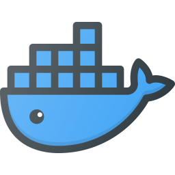
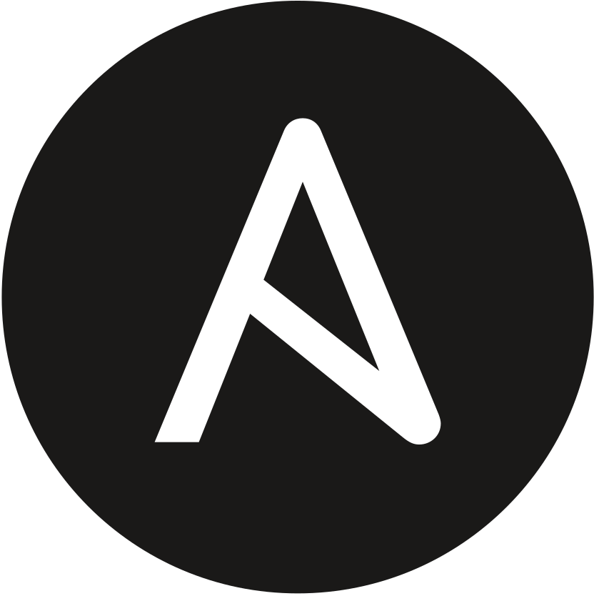

### Shalom 👋

- 🔭 I’m currently working on my fatherhood/parenting skills, [inji](https://github.com/shalomb/inji), [terrestrial](https://github.com/shalomb/terrestrial)
- 👨‍💼 At [`$dayjob`](https://www.takeda.com/sk-sk/who-we-are/icc/) I do AWS Cloud Platform/Infrastructure Engineering with a DevOps/SRE twist
- ⚡ I'm a proponent of [Platform Engineering](https://platformengineering.org/blog/what-is-platform-engineering) that's symbiotic with DevOps/Agile/[Design Thinking](https://www.interaction-design.org/literature/article/what-is-design-thinking-and-why-is-it-so-popular) practices
- 🌱 I dabble in [Distributed Systems](https://www.confluent.io/learn/distributed-systems/), Cloud Native Tech, Golang, Python
- 👯 I’d like to work on something nebulous yet lofty (☁️ "cloudy-native". get it?) with a nautical (☸) twist
- 🤔 I’m looking for help tackling [this Strava  segment](https://www.strava.com/segments/21756358) 🚴
- 💬 Ask me about 🇬🇧 expat brexit remainers 🇪🇺 living in Europe/Slovakia 🇸🇰. And 🤎 perl 🤎
- 😄 Pronouns: _Shalom!_ (Also the salutation I'd use in return ...) 😉
- 📫 How to reach me: [shalomb.id/#contact](https://shalomb.id/#contact)

<h3 align="left">What I do</h3>

 
 

 
 
 
 
 
 
 
 
 
 
 
 
 
 
 
 
 
 
 
 
 
 
 
 
 
 

